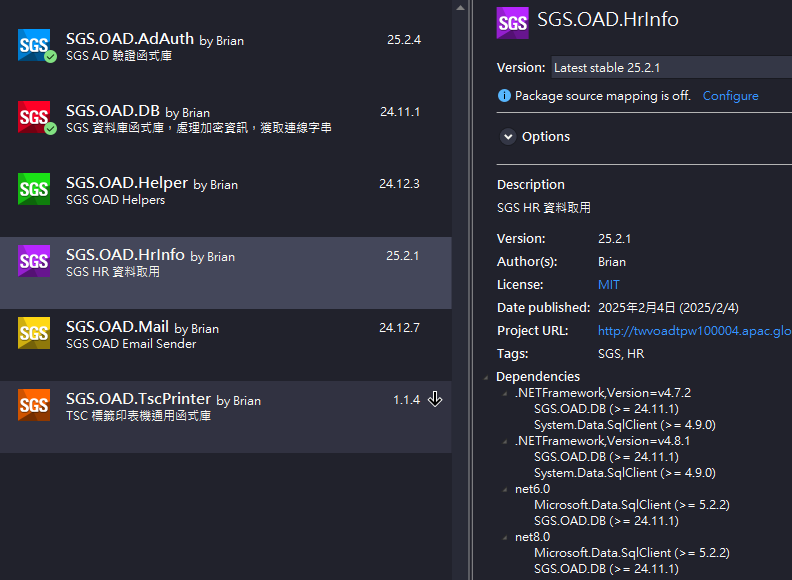

 
 


- 抓取 HR 資料套件，資料來源已預設，其餘使用方式後述
- 部署為內部 NuGet Package，依照正常套件使用方式即可

# 📦SGS.OAD.HrInfo



# ✨How to Use

- 新增內部 Package Source `\\twfs007\SGSSHARE\OAD\nuget\`
  - 可加入 `nuget.config` 組態檔 (建議放置與 `*.sln` 同層)
  - 或於 Visual Studio 2022 `NuGet Package Manager` 新增來源
- 安裝方式與一般 NuGet 套件相同，可透過 CLI 或使用 `NuGet Package Manager`
- 以下說明使用方式

# 🌳Using Namespace

```csharp
using SGS.OAD.HrInfo;
```

# 🚀Quick Start

使用預設值快速建置一個 `HrInfoHelper`

```csharp
var helper = HrInfoHelper.Create().Build();
```

# 📚Example

```csharp
// 透過 AD 帳號取得員工資料 (僅可取得在職員工)
var emp = helper.GetByAdId("your-ad-account");

// 透過員工編號取得員工資料 (不限在職或離職)
var emp = helper.GetByEmpId("your-emp-id");

// 僅取員工編號
var empId = helper.GetEmpId("your-ad-account");
```

💡透過方法取得之員工資料已轉為 `Employee` 型別物件

>⚠️ 因 AD 帳號會重複，舉凡透過 AD 帳號取資料者，均限制為有效帳號(在職員工)

# 🌐Custom Connection

如預設值資料來源無法使用，可自行設定連線字串，兩種方式擇一

- 直接注入連線字串
- 設定伺服器名稱與資料庫名稱，透過套件 `SGS.OAD.DB` 取得連線字串

```csharp
// 注入連線字串
var helper = HrInfoHelper.Create()
    .WithConnectionString("your-private-connection-string")
    .Build();

// 指定伺服器與資料庫
var helper = HrInfoHelper.Create()
    .WithDataBase("your-server-name", "your-db-name")
    .Build();
```

# ⚡Async

所有方法皆支援非同步操作

```csharp
var helper = await HrInfoHelper.Create().BuildAsync();

// 透過 AD 帳號取得員工資料
var emp = await helper.GetByAdIdAsync("your-ad-account");
// 透過員工編號取得員工資料
var emp = await helper.GetByEmpIdAsync("your-emp-id");
// 僅取員工編號
var empId = await helper.GetEmpIdAsync("your-ad-account");
```

💡所有非同步方法均支援取消操作 (即 `CancellationToken`)

# 🔍 Compare

||SGS.OAD.HrInfo|SGSLibrary|
|-:|:-:|:-:|
|類型|NuGet Package|DLL|
|回傳資料|強型別|字串|
|非同步方法|✔️|❌|
|外部資料來源注入|✔️|❌|
|資料庫連線字串解耦|✔️|❌|

⚠️因 HR 系統轉換，透過 `SGSLibrary`取得的資料可能有誤，必須改用 `SGS.OAD.HrInfo`